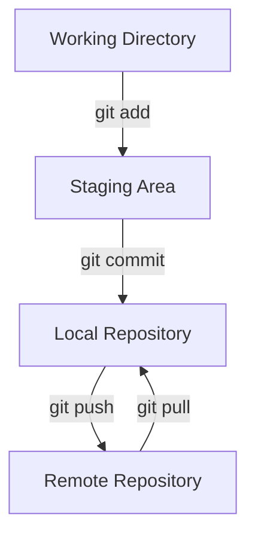
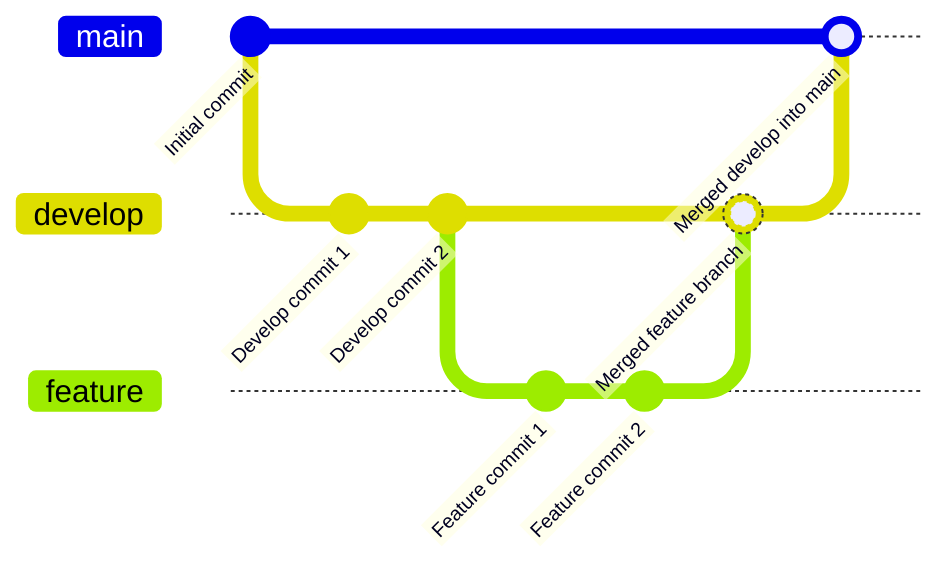
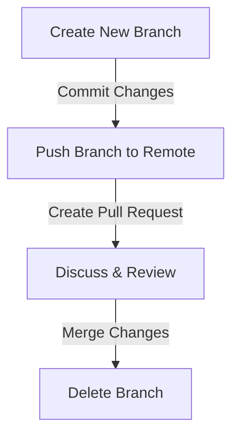

# Git Information, Main Concepts and Operations

In this document, we provide an introduction to Git, a popular version control system.
It is an essential tool for modern software development and deployment practices.

The outline of the document is as follows:

- [Code Versioning & Git](#code-versioning--git)
- [External References Links & Resources](#external-references-links--resources)
- [Main Concepts](#main-concepts)
- [Visual Representations](#visual-representations)
- [Basic Git Workflow](#basic-git-workflow)
- [Git & Branches](#git--branches)
- [Setting Up a Repository and Versioning](#setting-up-a-repository-and-versioning)
- [Adding Files](#adding-files)
- [Commits Changes](#commits-changes)
- [Pushing Changes](#pushing-changes)
- [Pulling Changes](#pulling-changes)
- [Resolving Conflicts](#resolving-conflicts)
- [Branching](#branching)
- [Merging Branches](#merging-branches)
- [Pull Requests](#pull-requests)
- [Best Practices](#best-practices)

## Code Versioning & Git

Code versioning is a critical aspect of software development that allows developers to track changes, collaborate, and manage code effectively.
Different version control systems are available such as Git, Mercurial, and Subversion.
However, **Git is the most popular and widely used version control system in the software development industry**.

Git is a distributed version control system used for tracking changes in source code during software development. 
It allows multiple developers to work on a project simultaneously without interfering with each other's work.

### External References Links & Resources

- [Git Installation](https://git-scm.com/book/en/v2/Getting-Started-Installing-Git)
- [Git Documentation](https://git-scm.com/doc)
- [Git Handbook](https://guides.github.com/introduction/git-handbook/)
- [Git Cheat Sheet](https://education.github.com/git-cheat-sheet-education.pdf)
- [Git Visual Guide](https://marklodato.github.io/visual-git-guide/index-en.html)

### Main Concepts

- **Repository (Repo)**: A directory where Git stores all versioned files and the history of changes.
- **Working Directory**: The directory on your local machine where you edit files.
- **Clone**: Copying a repository from a remote server to your local machine.
- **Stage**: Preparing changes to be committed.
- **Commit**: A snapshot of the project's files at a specific point in time.
- **Remote**: A version of the repository hosted on a server.
- **Origin**: The default name for the remote repository.
- **Push**: Uploading local commits to a remote repository.
- **Pull**: Downloading changes from a remote repository.
- **Branch**: A parallel version of the repository that diverges from the main line of development.
- **Merge**: Combining changes from different branches.
- **Conflict**: When two branches have changes to the same part of a file, and Git needs help to reconcile them.

### Visual Representations

In the following sections, we provide visual representations of common Git workflows and operations using simple diagrams.

### Basic Git Workflow

In this case we have the main steps in the Git workflow:

- **Working Directory**: The directory on your local machine where you edit files.
- **Staging Area**: A temporary storage area where you prepare changes to be committed.
- **Local Repository**: A local database that stores the history of changes and snapshots of the project.
- **Remote Repository**: A version of the repository hosted on a server (e.g., GitHub).

The main involved operations to move from one state to another are:

- **git add**: Move changes from the Working Directory to the Staging Area.
- **git commit**: Create a snapshot of the project's files at a specific point in time.
- **git push**: Upload local commits to a remote repository.
- **git pull**: Download changes from a remote repository.



### Git & Branches

In Git branches are a fundamental concept that allows you to work on different parts of a project simultaneously.
In the following example, we have the main steps to create a new branch associated with a new feature, work on it, and merge it back into the main branch.



### Setting Up a Repository and Versioning

The starting point to use Git is to set up a repository and start versioning your project files.
You can:

- Start with a Local Repository and later add a Remote Repository
- Start with a Remote Repository and clone it to your local machine

#### Start with Local Repository

It is possible to use Git for versioning without a remote repository.
Local versioning allows you to track changes in your project files without needing a remote repository.
Involved steps to set up a local repository:

Navigate to your project directory:

```sh
cd /path/to/your/project
```

Initialize a new Git repository:

```sh
git init
```

Then you can start adding files to the repository and tracking changes (see the upcoming sections).
Once you have a local repository set up, you can add a remote repository to collaborate with others and back up your work.
In order to add a remote repository, you need to create a repository on a platform like GitHub and then link it to your local repository.

For example, you can create a new repository on GitHub and then link it to your local repository.
You can create a new repository on GitHub by clicking on the "New" button on the repository page, then 
copy the repository URL and add it as a remote repository to your local repository.

```sh
git remote add origin https://github.com/username/repository.git main
```

If this case the "origin" is the default name for the remote repository, and **main** is the main branch.
The name of the main branch can be different depending on the repository configuration (e.g., "master" or "main").
This name will be used when pushing changes to the remote repository.

At this point, you can push your local repository to the remote repository on GitHub.
See the upcoming sections for more details on adding files and pushing changes to a remote repository.

#### Start with a Remote Repository Setup (e.g., GitHub)

On the opposite side, you can start by creating a repository on a platform like GitHub and then clone it to your local machine.
This approach is useful when you want to collaborate with others or back up your work on a remote server.
The steps to set up a remote repository on GitHub are:

1. **Sign up/In** to GitHub.
2. **Create a new repository**:
   - Click on the "New" button on the repository page.
   - Fill in the repository name, description (optional), and choose between public or private.
   - Click "Create repository".

The clone operation creates a local copy of the repository on your machine.

```sh
git clone https://github.com/username/repository.git
cd repository
```

At this point, you can start working on your project, add files, commit changes, and push them to the remote repository on GitHub.

### Adding Files

In both cases (local or remote repository), you need to add files to the Git repository to track changes.
In order to track changes in your project, you need to add files to the Git repository.
If files are not added, Git will not track them.
The operation of adding is called "staging".

```sh
# Add a single file
git add filename

# Add all files
git add .
```

### Commits Changes

When you have made changes to your files and are ready to update the repository, you need to commit the changes.
This operation creates a snapshot of the current state of the project and should be accompanied by a descriptive message 
and before pushing the changes to the remote repository.

```sh
# Stage and commit changes
git commit -m "Your commit message"

# Example: Adding and committing in one step
git commit -a -m "Added new feature"
```

## Pushing Changes

The push operation sends your local commits to the remote repository on GitHub.
Before pushing, ensure you have committed your changes.

```sh
git push origin main
```

In this case we are pushing the changes to the "main" branch of the remote repository.

### Pulling Changes

The pull operation fetches changes from the remote repository and merges them into your local repository.

```sh
git pull origin main
```

The name "origin" is the default name for the remote repository, and "main" is the main branch.
This allows you to keep your local repository up-to-date with the remote repository.

### Resolving Conflicts

In Git two of the main configuration when you can have conflicts are when you are merging branches or pulling changes from the remote repository.
A conflict is a situation where two branches have changes to the same part of a file, and Git needs help to reconcile them.
(Git does not know which changes to keep and which to discard :).

When Git encounters a conflict, it will mark the conflicted areas in the files.

You can see the conflicted files by running:

```sh
git status
```

This will show the conflicted files in red.
Then you have to manually resolve the conflicts in the files.
Each file will contain conflict markers like:

``
<<<<<<< HEAD
``

and 

```
>>>>>>> branch_name
>   
>   
>
```

You need to edit the file to resolve the conflict by choosing which changes to keep and which to discard.
When you have resolved the conflicts, you need to stage the files and commit the resolution.

```sh
# After resolving conflicts manually, stage the files
git add conflicted_file

# Then commit the resolution
git commit -m "Resolved merge conflict"
```

### Branching

The branching operation creates a new line of development separate from the main branch or other existing branches.
Branches are useful for isolating changes, working on new features, and experimenting without affecting the main codebase.
You can also merge branches back into the main branch when the changes are ready to be integrated and used.
You can also switch between branches to work on different parts of the project.

```sh
# Create a new branch
git branch new-branch

# Switch to the new branch
git checkout new-branch
```

You can also combine the creation and switching into a single command:

```sh
# Combine creation and switching into a single command
git checkout -b new-branch
```

### Merging Branches

Merging two branches combines the changes from one branch into another.
This operation is useful when you have finished working on a feature branch and want to integrate the changes back into the main branch.

This operation is done on the branch you want to merge changes into (e.g., the main branch).
Involves the following steps:

```sh
# Switch to the main branch
git checkout main

# Merge the feature branch into main
git merge new-branch
```

### Pull Requests

A pull request is a feature of Git platforms like GitHub that allows developers to review and discuss changes before merging them into the main branch.
It is a way to propose changes, discuss them, and ensure that the changes are ready to be integrated into the main codebase.

The main steps to create a pull request are:

1. **Create a new branch** for the changes.
2. **Commit changes** to the new branch.
3. **Push the branch** to the remote repository.
4. **Create a pull request** on the platform (e.g., GitHub).
5. **Discuss and review** the changes with other developers.
6. **Merge the changes** into the main branch.
7. **Delete the branch** after merging.

A visual representation of the pull request process:



### Best Practices

Some best practices to follow when using Git:
 
- **Commit Often**: Make small, frequent commits.
- **Use Meaningful Commit Messages**: Clearly describe what changes each commit contains.
- **Branch for Features**: Create a new branch for each feature or bugfix.
- **Pull Before Push**: Always pull the latest changes before pushing your own.
- **Resolve Conflicts Early**: Address merge conflicts as soon as they arise.
- **Review Code**: Use pull requests to review and discuss code before merging.